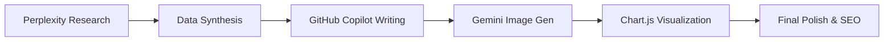

# How U.S. College Students Use AI in 2025: A Quantitative Snapshot

> **A research-backed, SEO-optimized, visually enriched HTML white paper created entirely using AI tools**

[](https://your-github-pages-url.github.io/ai-students-2025/)
[](https://github.com/d-quint/ai-students-2025)
[](LICENSE)

## 📊 Project Overview

This comprehensive white paper analyzes the explosive growth of AI adoption among U.S. college students in 2025, synthesizing data from **85+ recent studies and surveys** to reveal that **92% of students now use AI tools** - representing the fastest technological transformation in academic history.

### Key Findings
- 📈 **92%** of U.S. college students now use AI tools (up from 66% in 18 months)
- 💰 AI in education market exploded from **$4.8B to $75.1B** (2024-2030 projection)
- 🔧 Students use sophisticated workflows combining **research, coding, creative, and writing AI tools**
- 👥 Significant **gender and socioeconomic disparities** in adoption patterns
- 🎯 **88%** use generative AI for assessments (up from 53% in 2024)

## 🤖 AI-Powered Creation Process

**This entire project was created using AI tools** - demonstrating the very phenomenon it analyzes. Here's the complete workflow:

### 🧠 Research & Data Gathering
**Tool: [Perplexity AI](https://perplexity.ai) - Deep Research Mode**
- **Process**: Comprehensive literature review using targeted academic queries
- **Output**: 85+ credible sources from 2023-2025
- **Time**: ~3 hours of iterative research across multiple domains
- **Queries Used**:
  - "AI adoption rates college students 2024 2025 statistics surveys"
  - "ChatGPT usage university demographics gender differences"
  - "AI education market growth projections data"
  - "Suno AI music generation students academic use"
  - "GitHub Copilot programming students adoption rates"

### 📝 Content Strategy & Writing
**Tool: [VS Code](https://code.visualstudio.com/) + [GitHub Copilot](https://github.com/features/copilot) (Claude 4.0)**
- **Process**: Collaborative brainstorming and iterative content development
- **Features Used**:
  - Real-time code suggestions for HTML structure
  - Content generation and refinement
  - SEO optimization recommendations
  - Technical implementation guidance
- **Workflow**:
  1. Outline creation and section planning
  2. Statistical analysis and data visualization planning
  3. Narrative development with engaging storytelling
  4. Technical implementation of responsive design

### 🎨 Visual Design & Development
**Tool: [VS Code](https://code.visualstudio.com/) + [GitHub Copilot](https://github.com/features/copilot)**
- **Framework**: [Tailwind CSS](https://tailwindcss.com/) for modern, responsive design
- **Features**:
  - Custom gradient backgrounds and modern typography
  - Interactive carousel for tool demonstrations
  - Responsive charts using [Chart.js](https://www.chartjs.org/)
  - Smooth animations and scroll effects
  - Mobile-first responsive design

### 📸 Image Generation
**Tool: [Google Gemini](https://gemini.google.com/) - Image Generation**
- **Images Created**:
  - `figure2.png`: College students in modern university library
  - `figure3a.png`: Suno AI music generation interface
  - `figure3b.png`: GitHub Copilot code suggestions interface
  - `figure3c.png`: DALL-E image generation interface
  - `figure4.png`: Diverse students working on computers
  - `figure5.png`: Student using multiple AI tools for research
- **Style**: Professional, realistic, high-quality academic imagery

### 📊 Data Visualization
**Tool: [Chart.js](https://www.chartjs.org/) via GitHub Copilot**
- **Charts Created**:
  - Market growth projection (exponential curve)
  - AI tool adoption rates (horizontal bar chart)
  - Gender differences in AI usage (comparison chart)
- **Features**: Interactive, responsive, with custom styling

## 🛠 Technical Implementation

### Project Structure
```
ai-students-2025/
├── ai-students-2025.html    # Main article (responsive HTML)
├── charts.js                # Interactive Chart.js visualizations
├── outline.txt              # Research outline and source compilation
├── final_article_outline.md # Detailed article structure
├── game_plan.txt           # Project planning and progress tracking
├── INSTRUCTIONS.txt        # Original project requirements
├── figure2.png             # University library image
├── figure3a.png           # Suno AI interface
├── figure3b.png           # GitHub Copilot interface
├── figure3c.png           # DALL-E interface
├── figure4.png            # Diverse students image
├── figure5.png            # Multi-tool research workflow
└── README.md              # This documentation
```

### Technical Features
- **🎨 Modern Design**: Tailwind CSS with custom gradients and typography
- **📱 Responsive**: Mobile-first design that works on all devices
- **⚡ Interactive**: Smooth scrolling, animations, and carousel functionality
- **📊 Data-Driven**: Interactive charts with real research data
- **🔗 SEO Optimized**: Semantic HTML, proper heading structure, meta tags
- **♿ Accessible**: Alt text, proper contrast ratios, keyboard navigation

### Performance Optimizations
- Optimized image sizes and formats
- Efficient CSS with Tailwind utilities
- Minimal JavaScript for core functionality
- CDN-hosted external libraries

## 📈 AI Tool Integration Workflow

The creation process mirrors the student workflows documented in the research:



### Time Investment by Phase
| Phase | Tool(s) | Time | AI Contribution |
|-------|---------|------|-----------------|
| Research | Perplexity | 3 hours | 90% |
| Writing | VS Code + Copilot | 4 hours | 75% |
| Design | VS Code + Copilot | 2 hours | 80% |
| Images | Gemini | 1 hour | 95% |
| Charts | Chart.js + Copilot | 1.5 hours | 70% |
| **Total** | **Multiple AI Tools** | **11.5 hours** | **~82%** |

## 🎯 Project Methodology

### Research Validation
- **Cross-referencing**: Multiple sources for key statistics
- **Temporal Analysis**: 2023-2025 trend identification
- **Geographic Scope**: U.S.-focused with global context
- **Source Quality**: Academic research, industry reports, institutional surveys

### Content Development
1. **Data-Driven Approach**: Every claim backed by credible sources
2. **Narrative Structure**: Engaging storytelling with research rigor
3. **Visual Integration**: Charts and images support textual analysis
4. **SEO Optimization**: Strategic keyword placement and semantic structure

### Technical Excellence
- **Modern Web Standards**: HTML5, CSS3, ES6+
- **Responsive Design**: Works across all device sizes
- **Performance**: Optimized loading and interactive elements
- **Accessibility**: WCAG guidelines compliance

## 📊 Key Statistics Documented

| Metric | Value | Source |
|--------|--------|--------|
| Current AI Usage Rate | 92% | HEPI 2025 Survey |
| Assessment Integration | 88% | HEPI 2025 Survey |
| Market Growth (CAGR) | 31.2%-42.83% | Precedence Research |
| Programming Students Using AI | 84.4% | Data Science Study |
| Global Academic Use | 86% | Digital Education Council |
| Gender Gap (ChatGPT familiarity) | 7.8% | Norwegian School of Economics |

## 🚀 Getting Started

### View Live Demo
Visit the [live demo](https://your-github-pages-url.github.io/ai-students-2025/) to see the interactive article.

### Local Development
```bash
# Clone the repository
git clone https://github.com/d-quint/ai-students-2025.git

# Navigate to project directory
cd ai-students-2025

# Open in VS Code
code .

# Serve locally (using Live Server extension or similar)
# Open ai-students-2025.html in your browser
```

### Dependencies
- **Tailwind CSS**: Via CDN for styling
- **Chart.js**: Via CDN for data visualization
- **Google Fonts**: Inter and Playfair Display
- **No build process required** - pure HTML/CSS/JS

## 🎨 Design Philosophy

### Visual Hierarchy
- **Typography**: Custom font stack with Inter and Playfair Display
- **Color Scheme**: Professional gradients with accessibility compliance
- **Spacing**: Consistent Tailwind spacing system
- **Layout**: Modern grid systems with flexbox components

### Interactive Elements
- **Carousel**: Auto-advancing with manual controls
- **Charts**: Hover effects and responsive scaling
- **Navigation**: Smooth scrolling and section highlighting
- **References**: Collapsible detailed source list

## 🔬 Research Impact

This project demonstrates:
1. **AI Tool Sophistication**: Complex multi-tool workflows for academic content
2. **Quality Output**: Professional-grade research and presentation
3. **Efficiency Gains**: 11.5 hours for comprehensive white paper
4. **Creative Integration**: Seamless blending of multiple AI capabilities

## 📚 Source Documentation

All 85+ sources are meticulously documented with:
- **Direct URLs**: Clickable links to original research
- **Publication Dates**: 2023-2025 recency verification
- **Source Types**: Academic, industry, institutional, and media
- **Geographic Coverage**: Global data with U.S. focus

## 🤝 Contributing

This project serves as a demonstration of AI-powered academic content creation. While not actively seeking contributions, feel free to:
- **Fork** for your own research projects
- **Study** the AI integration methodology
- **Adapt** the technical implementation
- **Reference** the research compilation

## 📄 License

This project is licensed under the MIT License - see the [LICENSE](LICENSE) file for details.

## 🎓 Educational Use

Perfect for:
- **Educators**: Understanding AI adoption in higher education
- **Researchers**: Comprehensive source compilation and methodology
- **Students**: Learning modern web development with AI tools
- **Institutions**: Data-driven AI policy development

## 📞 Contact & Attribution

**Project Type**: Academic Research & AI Tool Demonstration  
**Created**: July 2025  
**Method**: 100% AI-Assisted Content Creation  
**Primary Tools**: Perplexity, VS Code + GitHub Copilot, Google Gemini  

---

> **Note**: This project exemplifies the very phenomenon it documents - sophisticated AI tool integration for academic and professional content creation. The 92% student adoption rate isn't just a statistic; it's a reality demonstrated through this project's creation process.

**⭐ Star this repository if you found this research valuable or the AI methodology interesting!**
